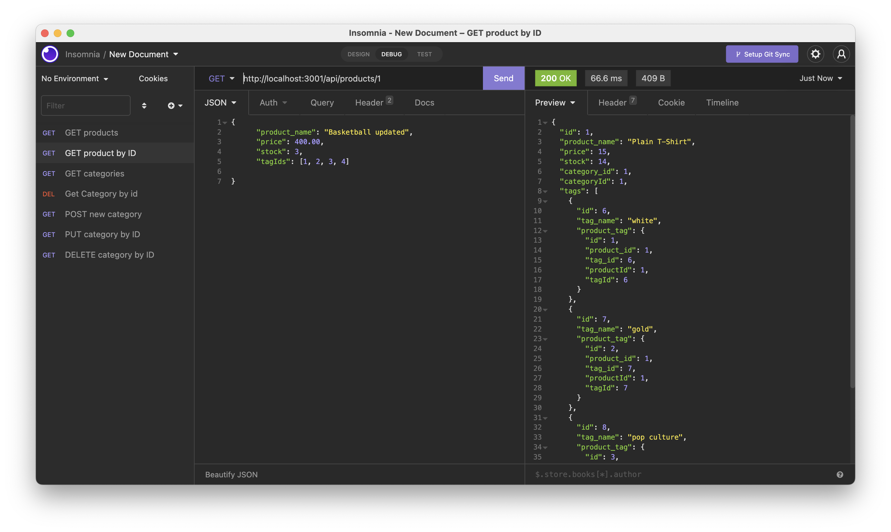

## E_commerceBackEnd-ER 

### Description

E_commerceBackEnd-ER is a back-end application that has connection with Sql database.
the tables are generated using Models and seeds for insert record into the database.
### Techologies

- NodeJs

### Npm Packages

> This Application has the following NPMs: 

- dotenv: protection of database password, username and db_name.
- express: manage server and routes.
- mysql2: for database access.
- sequelize: Enables JavaScript to work with relational database. 

### Link

- [GitHub Repo ](https://github.com/raphson1/e_commerceBackEnd-ER)

### Licence

> This application has no Licence.

### Contibutors:

- Eric Ruboneka: 
  - [GitHub](https://github.com/raphson1)
  - Email: Raphsoneric@gmail.com

### Image

### Vidoeo

click on the link below to watch the video

https://drive.google.com/file/d/1ec_B84f1rDOn3oFsh6mfa6wfyvRzUvvY/view?usp=sharing

